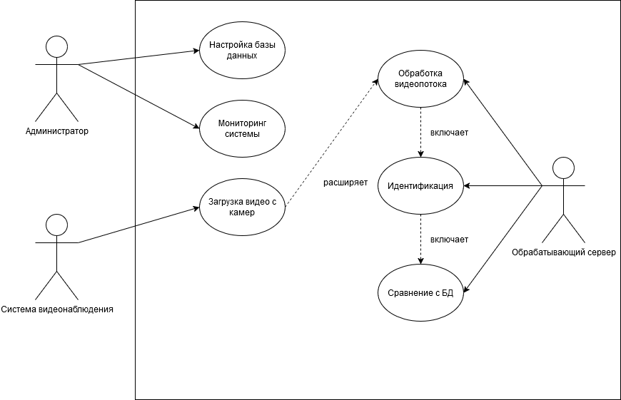

# Лабораторная работа №1  
**Тема:** Формулирование требований к программной системе  
**Цель работы:** Научиться анализировать поставленную задачу, формулировать функциональные и нефункциональные требования к проектируемой системе.  

---

## 1. Перечень заинтересованных лиц (стейкхолдеров):
1. **Администрация учебного заведения**  
   - Основной заказчик и пользователь системы. Заинтересована в улучшении безопасности и автоматизации процессов управления доступом в помещения.  

2. **Сотрудники службы безопасности**  
   - Пользователи системы, контролирующие работу системы и реагирующие на возможные инциденты.  

3. **Преподаватели**  
   - Пассивные пользователи, чьи данные хранятся в системе.  

4. **Студенты**  
   - Основные конечные пользователи, чьи лица распознаются для идентификации.  

5. **IT-отдел учебного заведения**  
   - Занимается обслуживанием системы, её настройкой и интеграцией с другими информационными системами.  

6. **Разработчики системы**  
   - Команда, ответственная за создание, тестирование и внедрение системы.  

---

## 2. Перечень функциональных требований:

1. Распознавание лиц сотрудников и студентов.  
2. Ведение базы данных лиц (добавление, обновление, удаление).  
3. Логирование результатов распознавания.

---

## 3. Диаграмма вариантов использования (Use Case Diagram):  

---

## 4. Перечень сделанных предположений:

1. Камеры видеонаблюдения высокого качества уже установлены в учебном заведении.  
2. Система работает в защищенной локальной сети.  
3. Для обучения нейронной сети предоставлен набор данных лиц сотрудников и студентов.  
4. Интеграция с законодательными нормами по защите персональных данных будет учтена.  
5. Система поддерживает русский и английский языки интерфейса.  

---

## 5. Перечень нефункциональных требований:

1. **Производительность:** Система должна обрабатывать видеопоток с максимально возможной скоростью.
2. **Надежность:** Система должна обеспечивать корректную работу не менее 99.5% времени.  
3. **Масштабируемость:** Возможность добавления новых камер и пользователей без снижения производительности.  
4. **Безопасность:** Шифрование всех передаваемых данных (использование HTTPS, SSL/TLS).  
5. **Совместимость:** Поддержка интеграции с существующими системами доступа и управления.  
6. **Удобство использования:** Интуитивно понятный интерфейс для разных типов пользователей (администрация, IT-отдел, служба безопасности).  