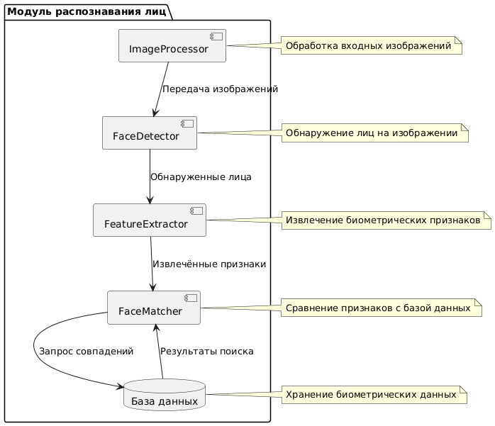

# Лабораторная работа №2  

**Тема:** Использование нотации C4 model для проектирования архитектуры программной системы  
**Цель работы:** Получить опыт использования графической нотации для фиксации архитектурных решений.  

---

## 1. Диаграмма системного контекста  

---

## 2. Диаграмма контейнеров  

---

## 3. Диаграмма компонентов модуля системы распознавания

---

## 4. Диаграмма компонентов сервиса отчетов

