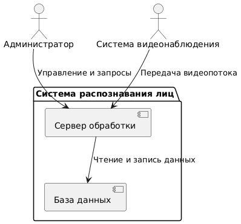
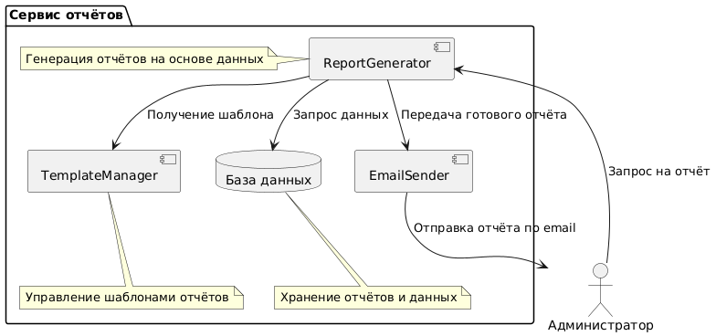
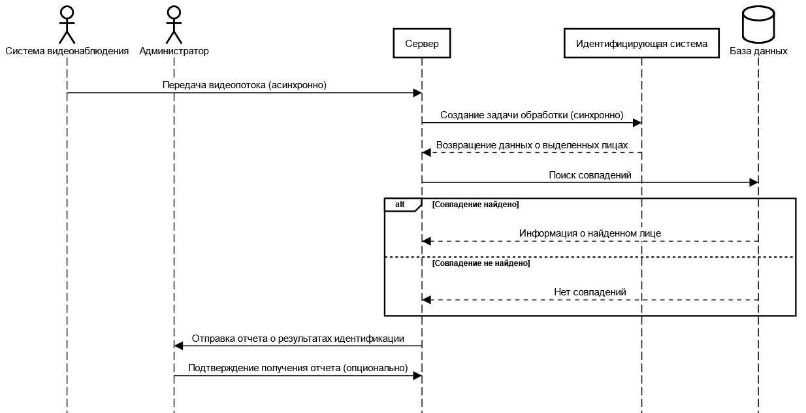
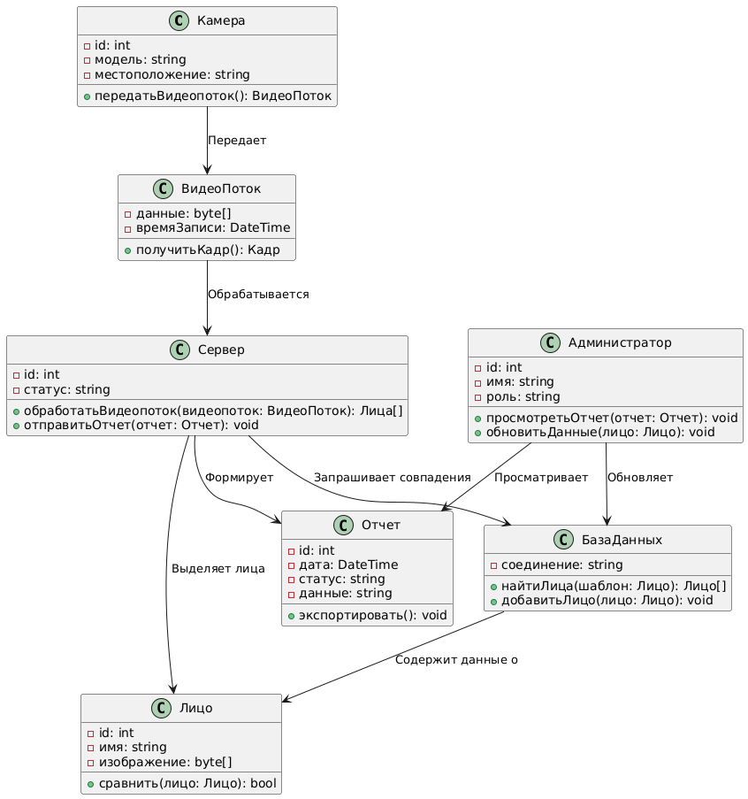

# Лабораторная работа №3

**Тема:** Использование принципов проектирования на уровне методов и классов  
**Цель работы:** Получить опыт проектирования и реализации модулей с использованием принципов KISS, YAGNI, DRY, SOLID и др.

---

## 1. Диаграммы нотации C4 model

### Диаграмма системного контекста  

### Диаграмма контейнеров  

### Диаграмма компонентов модуля системы распознавания

### Диаграмма компонентов сервиса отчетов

---

## 2. Диаграмма последовательностей

---

## 3. Модель БД

---